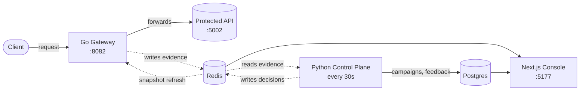
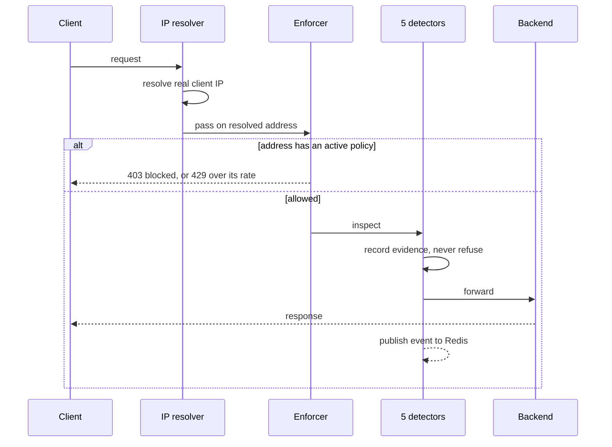
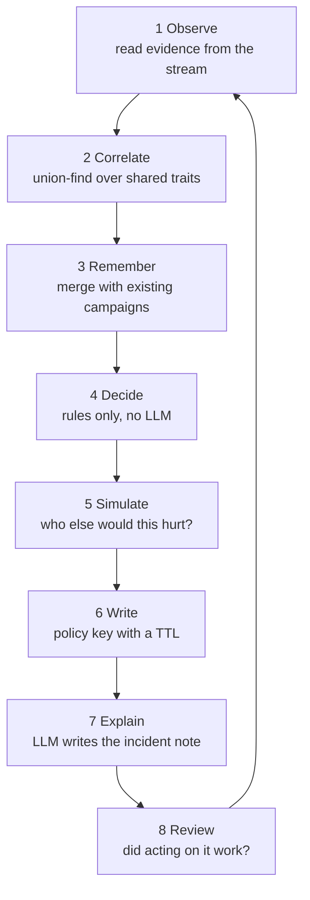

# Intelligent API Security Gateway

A reverse proxy that sits in front of an API, watches every request, and refuses
the ones that belong to an attack — paired with an agent that works out what is
an attack in the first place.

The interesting problem is not detection. It is that those two jobs have
incompatible requirements, and most of the design follows from taking that
seriously.

---

## The problem

A security gateway is on the critical path of every request. Its budget is
microseconds, and it must never be the reason the API is slow or down.

But deciding whether an address is attacking you is not a microsecond question.
It needs history ("has this address done this before?"), breadth ("are these
forty addresses one botnet?"), and judgement ("is this a scanner or a customer
with a retry loop?"). Doing that work inside a request means a network round
trip, or a model call, in the path of every customer.

Most projects resolve this by making the detector dumber. This one splits it in
two instead.

---

## Architecture



**The data plane** (Go, ~5,000 lines) runs per request. It detects, enforces a
decision it *already has*, and gets out of the way. It never waits on Redis,
never waits on the control plane, never waits on a model.

**The control plane** (Python, ~3,900 lines) runs every 30 seconds, off the
request path. It reads the evidence, correlates it, decides, and writes the
decision back for the gateway to find later.

The dotted lines carry the whole idea: the gateway **writes evidence it does not
interpret**, and **reads decisions it did not make**. Neither side blocks the
other. If the control plane dies, the gateway keeps enforcing what it already
knows. If Redis dies, that reads as "no policy" — never as added latency.

---

## What happens to a request



Three properties are load-bearing here:

**The client IP is resolved first.** `X-Forwarded-For` is believed only from a
configured trusted proxy. Anyone can set that header, so trusting it blindly
would let an attacker pin blame on someone else's address.

**Enforcement happens before detection.** A refused request never reaches a
detector, which is correct — there is nothing to learn from a request that was
never served.

**Detectors never refuse anything.** They score and report. That is what makes
a false positive cost a log line rather than a customer.

The five detectors are flooding, SQL injection, brute force, path
traversal/enumeration, and IP reputation. Four are behavioural and windowed —
they need the attacker to repeat themselves. Reputation is the exception: it
asks *who* an address is rather than what it did, so it is the only signal that
knows anything on a first request.

---

## What happens to an attack



Step 2 is the point of the project. Union-find clustering turns six separate
"IP X failed a login" events into one *"these six addresses are running a
credential-stuffing campaign against `/api/login`"*. A campaign, not an
incident, is what gets acted on.

Step 8 is what makes it an agent rather than a rule engine. Every campaign is
re-examined next cycle: if the attack **survived** enforcement, the response is
promoted one rung up the ladder — `monitor → throttle → temp_block → escalate`.
An action that did not work is not simply repeated.

Enforcement releases itself. Every policy key carries a TTL and nothing renews
it; an attacker who stops is forgiven automatically, and a mistake expires on
its own rather than needing a human to notice.

---

## Design decisions worth defending

**The SRS asked for a centralised risk-scoring decision engine. It was
deliberately not built.** Scoring is per-detector, and deciding is split between
a fast gateway reflex and the considered control plane. A central engine would
have to be either on the request path (too slow to think) or off it (too slow to
react) — the split is what lets it be both. The `trust_engine` config block that
described it was **deleted rather than implemented**, because it was being
parsed into structs nothing read: configuration that advertises a component
which does not exist is worse than no configuration.

**Rules decide; the LLM only narrates.** Grouping, scoring and the block
decision are plain deterministic Python. The model writes the incident note and
a review of the grouping, *after* policy is already written, and nothing reads
its output back. A hallucinated or prompt-injected assessment can mislead a
human reader; it cannot unblock an attacker.

**A human outranks the agent, and disagreement is the only thing worth learning
from.** An operator override is applied immediately and remembered — after two
consistent corrections it shifts the agent's own recommendation for that kind of
campaign.

**The rails live together** in the one file that can influence the gateway:
never police loopback, private or reserved addresses; never write a policy
without an expiry; cap how many addresses one cycle may action; and honour a
dry-run that decides everything and writes nothing.

---

## Honest gaps

Stated rather than hidden, because they are the real answer to "what would you
do next":

- **No request body cap.** Both telemetry and the detectors read the body with
  `io.ReadAll` and no limit, and the telemetry read happens *before* the
  enforcer — so a blocked address's body is still buffered whole.
- **The console has no authentication.** Whoever can reach port 5177 can disable
  enforcement.
- **No graceful shutdown, no health endpoint, no metrics.**
- **Detection is substring matching.** `UNION/**/SELECT` walks past the SQLi
  detector. Sophisticated inference over shallow signals is still shallow.

---

## The numbers

| | Source | Tests | Test functions |
|---|---|---|---|
| Gateway (Go) | 5,034 | 3,552 | 165 |
| Control plane (Python) | 3,925 | 3,289 | 249 |
| Console (Next.js) | ~4,500 | — | — |

**414 tests**, and a test-to-source ratio near 0.8:1 on both engines. The tests
assert properties rather than paths — that reputation cannot invent enforcement,
that bias cannot compound past one rung, that a narration failure can never fail
a cycle, that a campaign survives the attacker changing every address.

## Running it

```bash
docker compose -f infra/docker-compose.yml up -d
```

| Service | URL |
|---|---|
| Gateway | http://localhost:8082 |
| Protected API | http://localhost:5002 |
| Console | http://localhost:5177 |
| Documentation | http://localhost:8000 |

Full walkthroughs, including driving a real attack end to end and watching a
policy appear, are in [`README.md`](README.md). Design detail for each half is
in [`gateway/README.md`](gateway/README.md) and
[`control-plane/README.md`](control-plane/README.md).
