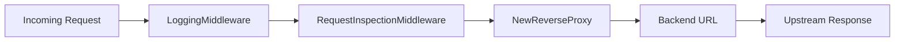

# Proxy Module

## Overview

The proxy module is the active implementation core of the repository. It owns listener startup, middleware orchestration, and reverse proxy forwarding to the protected backend service.

## Purpose

Its purpose is to accept inbound requests, apply the current middleware chain, and forward traffic to the backend service.

## Architecture Explanation

`proxy.NewServer` stores the listen address, backend URL, and timeout values in a `Server` value. `Server.Start` creates a reverse proxy with `NewReverseProxy`, wraps it with `LoggingMiddleware` and `RequestInspectionMiddleware`, and starts an `http.Server`. `NewReverseProxy` uses `httputil.NewSingleHostReverseProxy` and sets the `X-Gateway: IASG` header before the request is sent upstream.

The middleware implementation is simple and synchronous. Logging prints request metadata to standard output. Inspection prints headers and reads the entire request body into memory before restoring it for downstream use.

## Code References

| Path | Role |
| --- | --- |
| `internal/proxy/server.go` | Server construction and middleware assembly. |
| `internal/proxy/middleware.go` | Middleware type, chaining logic, and current inspection behavior. |
| `internal/proxy/reverse_proxy.go` | Reverse proxy creation and header mutation. |
| `cmd/gateway/main.go` | Minimal bootstrap that configures and starts the proxy package. |

## Flow Diagram

