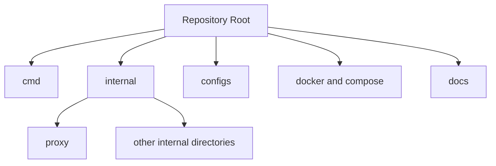

# Project Structure

## Overview

The repository is organized around a small executable entrypoint, the implemented proxy package, support files, and documentation.

## Purpose

This page shows which directories contain active code and which directories currently exist without implementation.

## Architecture Explanation

`cmd/gateway` contains the executable entrypoint. `internal/proxy` contains the implemented server, middleware, and reverse proxy logic. The other directories under `internal/` exist in the repository but do not currently contain Go source files. `configs/` and `docker-compose.yml` are present in the tree, but the current binary does not load the YAML configuration or connect to Redis or PostgreSQL.

## Code References

| Path | Role |
| --- | --- |
| `cmd/gateway/` | Executable bootstrap for the gateway binary. |
| `internal/proxy/` | Implemented reverse proxy server and middleware. |
| `internal/context/` | Present in the repository but currently empty. |
| `internal/enforcement/` | Present in the repository but currently empty. |
| `internal/signals/` | Present in the repository but currently empty. |
| `internal/storage/` | Present in the repository with empty adapter directories. |
| `internal/trust/` | Present in the repository but currently empty. |
| `configs/` | Contains example configuration that is not loaded by the current binary. |
| `docs/` | MkDocs documentation content. |

## Flow Diagram



## Repository Map

```text
.
├── cmd/
│   └── gateway/
│       └── main.go
├── configs/
│   └── config.yaml.example
├── docker/
├── docs/
│   ├── index.md
│   ├── system-architecture.md
│   ├── request-lifecycle.md
│   ├── running-locally.md
│   ├── project-structure.md
│   ├── javascripts/
│   │   └── mermaid.js
│   └── modules/
│       └── proxy-module.md
├── internal/
│   ├── config/
│   ├── context/
│   ├── enforcement/
│   ├── proxy/
│   ├── signals/
│   ├── storage/
│   │   ├── postgres/
│   │   └── redis/
│   └── trust/
├── docker-compose.yml
├── go.mod
└── README.md
```