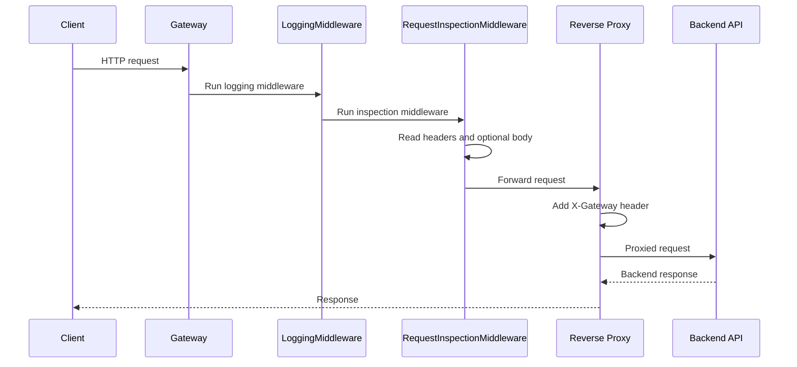

# Request Lifecycle

## Overview

Each inbound request moves through a small middleware chain and is then forwarded to the backend.

## Purpose

This page documents the exact request path that exists in the code today.

## Architecture Explanation

The HTTP server accepts the request and passes it into the middleware chain configured in `internal/proxy/server.go`. `LoggingMiddleware` runs first and prints basic request metadata. `RequestInspectionMiddleware` runs next and prints headers and body content. If a request body exists, it is read into memory and then restored with `io.NopCloser` so the downstream reverse proxy can still consume it. After inspection, the request is sent through the reverse proxy to the configured backend URL. Before forwarding, the proxy sets the `X-Gateway: IASG` header.

## Code References

| Path | Role |
| --- | --- |
| `internal/proxy/server.go` | Builds the current middleware chain and starts the HTTP server. |
| `internal/proxy/middleware.go` | Shows the existing pre-forward request processing steps. |
| `internal/proxy/reverse_proxy.go` | Represents the current terminal forwarding step. |

## Flow Diagram

