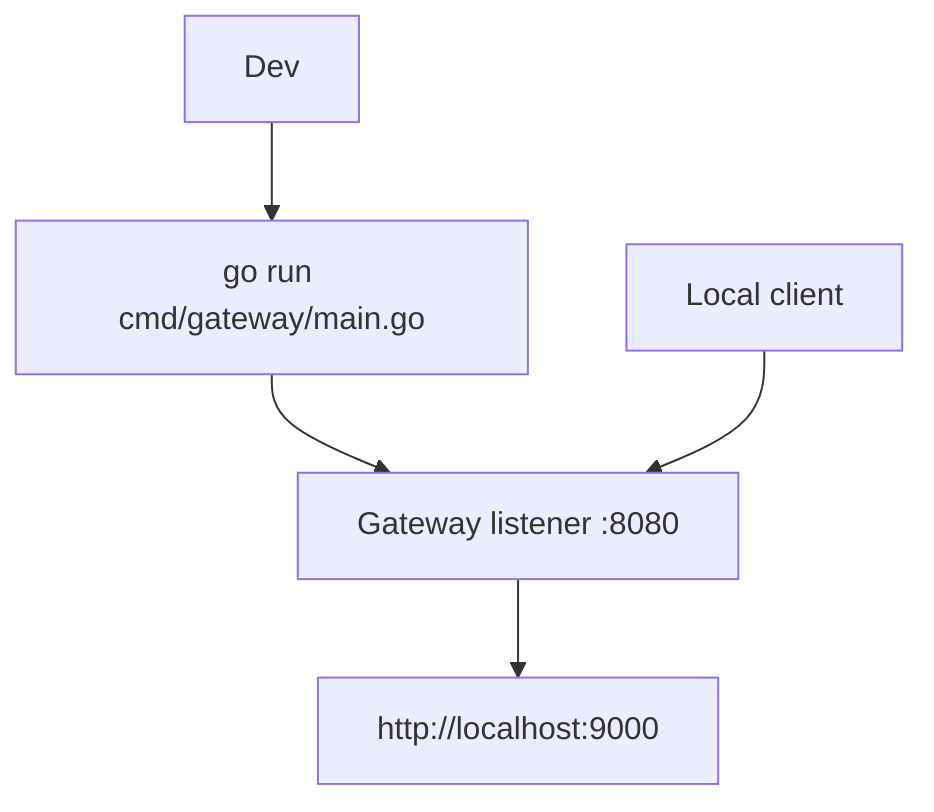

# Running the Gateway Locally

## Overview

The current local workflow is to run the gateway process directly with Go and point it at a reachable backend service.

## Purpose

This page provides the shortest path to exercise the implemented reverse proxy behavior.

## Architecture Explanation

The current binary does not load runtime configuration from `configs/config.yaml.example`. In `cmd/gateway/main.go`, the listen address is hardcoded to `:8080` and the backend URL is hardcoded to `http://localhost:9000`. If that backend is available, the gateway can be started directly with `go run`.

## Code References

| Path | Role |
| --- | --- |
| `cmd/gateway/main.go` | Current local execution path for the gateway process. |
| `internal/proxy/server.go` | Starts the HTTP server with timeouts and middleware. |
| `go.mod` | Declares the Go module and dependency graph. |

## Flow Diagram



## Steps

1. Start a backend HTTP service on `http://localhost:9000`.

   ```bash
   python3 -m http.server 9000
   ```

2. Download Go dependencies and run the gateway:

   ```bash
   go mod download
   go run cmd/gateway/main.go
   ```

3. Send requests to `http://localhost:8080`.

   ```bash
   curl -i http://localhost:8080
   ```

## Notes

- The gateway currently depends on the backend at `http://localhost:9000` being available.
- PostgreSQL, Redis, and the example YAML configuration are present in the repository but are not used by the current gateway binary.