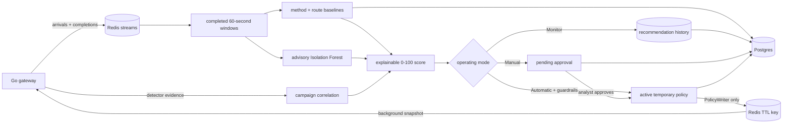

# Adaptive policy and analyst control

The adaptive system runs entirely in the Python control plane after a
60-second window closes. The Go gateway never calculates a baseline or loads a
model. It only reads an expiring policy snapshot in the background and makes a
bounded in-memory lookup before any request body is read.



## Baselines

Keys are the normalized HTTP method and configured route template, never the
raw URL or query string. `POST /api/login` and `GET /api/products` therefore
learn independently, while `/api/products/12` and `/api/products/34` share the
`GET /api/products/{id}` baseline.

For each endpoint the learner retains a bounded rolling sample and calculates
`median + mad_multiplier × max(MAD, minimum_mad)`. The result is clamped to the
configured endpoint limits. A threshold must clear hysteresis and cooldown
before changing. Until `warmup_windows` trusted samples exist,
`baseline_ready=false` and behavioural deviation cannot authorize a throttle
or block.

Only complete, detector-clean, allowed windows with all 60 consecutive gateway
health heartbeats enter learning. Windows with a signal, active enforcement,
missing completion, heartbeat gap, or telemetry-drop delta remain visible as
the latest observation but are excluded from the sample.

## Risk and confidence

The 0–100 risk score is a configured weighted sum of deterministic evidence,
endpoint deviation, campaign facts, and ML anomaly. Every stored recommendation
contains the raw component, configured weight, weighted points, final score,
and guardrail result. The score is bounded to 0–100 and clamped at every
component; policy confidence is a second, separately-derived 0–1 number (see
[Advisory ML signals](#advisory-ml-signals) below) — the two are never
combined into one figure.

Every number behind that score falls into one of four kinds. Telling them
apart is what keeps the configuration surface small: a value only becomes a
setting once an operator could sensibly want it different, and there are far
fewer of those than there are numbers in the code.

> A value is **configurable policy** if it answers *"what should we do about
> it?"*. It stays **fixed** if it answers *"what is happening?"* — detection
> and campaign correlation are definitional, not policy — or if it **bounds
> the worst case**: a rail an operator must not be able to unbolt.

### Fixed safety guardrails

Cannot be configured away, by design. These hold regardless of what
`adaptive.json` says:

| Rail | Where | What it prevents |
| --- | --- | --- |
| No deterministic evidence → Monitor, unconditionally | `adaptive/risk.py` `_guard` | A statistical surprise (ML, behaviour) can never be sole authority to act |
| Detector points configured to zero → Monitor | `adaptive/risk.py` `_guard` | Zeroing out `detector_points` cannot be used to silently disable the floor above |
| Reputation excluded from deterministic evidence | `adaptive/risk.py` `calculate_risk` | A list membership is a prior, not an observed event; it can firm up a decision but never originate one |
| Two detectors firing on one request count once | `adaptive/risk.py` `calculate_risk` | De-duplicated by `stream_id`, so evidence volume can't be inflated by request, only by distinct observation |
| `maximum_policy_duration_seconds` binds every write, including human overrides | `policy/writer.py`, `feedback/overrides.py` | An analyst's `escalate` cannot stand longer than the configured ceiling — see below |
| Allowlist outranks everything, including a human | `policy/simulation.py` | A declared range is the more considered of two decisions, not the agent overruling a person |
| No private/reserved/loopback address, no policy without a TTL, per-cycle write cap, dry-run | `policy/writer.py` | Bounds the blast radius of one bad cycle regardless of configuration |
| The validation bounds themselves (below) | `adaptive/config.py` `validate()` | An operator sets a value *within* a bound, never past it — the bound is not itself a setting |

`feedback/overrides.py`'s TTL resolution is worth calling out by name: a
console override without an explicit duration used to fall back to a
module-level constant that could exceed `maximum_policy_duration_seconds` —
an `escalate` override, in particular, defaulted to twice the ceiling, and
nothing downstream re-checked it because the ceiling check only ran for
agent-issued decisions. Every override's TTL — explicit or defaulted — is now
resolved against `AdaptiveConfig.guardrails` and capped at the same ceiling
the agent itself cannot exceed.

### Configurable policy limits

What to do, how hard, and for how long — the actual `AdaptiveConfig` surface.
All defaults and bounds are in
`control-plane/configs/adaptive.json.example`, whose three top-level blocks
(`baseline`, `risk`, `guardrails`) map onto these categories as: `baseline` is
category 3 below, `risk` and `guardrails` are this one, and `risk.ml_weight`
specifically is category 4. Set `IASG_ADAPTIVE_CONFIG` to that path (or JSON
text) for a non-Postgres launch. With Postgres enabled, the dashboard stores
the validated live configuration in `adaptive_settings` and the control plane
reads it at the start of every cycle.

The dashboard's settings form exposes most of this surface, but not all of
it — `risk.detector_points`, `risk.severity_multipliers`,
`repeated_evidence_increment`, the two confidence weights, and
`guardrails.analyst_escalation_*` are env/SQL-only today, changeable through
`IASG_ADAPTIVE_CONFIG` or a direct update to `adaptive_settings` but not from
the console.

The server and Python loader enforce the same validated bounds — the
mechanism by which a configurable value cannot be pushed past a fixed
ceiling:

| Setting group | Validated bounds |
| --- | --- |
| Rolling/warm-up windows | 3-1440; warm-up cannot exceed the rolling sample |
| MAD multiplier / minimum MAD | 0.1-20 / 0-1000 |
| Learned endpoint RPM | ordered minimum and maximum within 1-100,000 |
| Hysteresis / baseline cooldown | 0-0.5 / 0-86,400 seconds |
| Risk weights | each 0-1 and total 1; action scores ordered within 0-100 |
| Confidence floors / ML strength | each 0-1; block confidence cannot be below throttle |
| Active durations | positive, each no greater than the 30-86,400 second global maximum |
| Throttle RPM | ordered minimum, default, maximum within 1-100,000 |
| Minimum evidence | throttle at least one request; block no lower than throttle |
| Emergency ranges | syntactically valid IPv4/IPv6 address or CIDR; allow wins on overlap |

Unknown fields are rejected instead of being silently ignored. Settings edits
use an optimistic version check, so one analyst cannot overwrite another
analyst's newer configuration from a stale page.

This is also the gateway's own configurable-limits lane, on the other side of
the Redis boundary — `policy-enforcement.md`'s Configuration section owns rate
limits, block durations, and detector thresholds for the Go process itself,
which never reads `AdaptiveConfig` or Postgres directly.

### Learned adaptive baselines

Per-endpoint `median + mad_multiplier × MAD`, described in
[Baselines](#baselines) above. The distinguishing property: a learned value is
never trusted raw. It is always clamped by a *fixed* rail
(`minimum_threshold_rpm`/`maximum_threshold_rpm`), gated by `warmup_windows`
before it can authorize anything, and admitted only from windows that were
`safe_to_learn` — complete, detector-clean, and allowed. Hysteresis and
cooldown then bound how fast a trusted value may itself move. Nothing here
is advisory the way ML is: once `baseline_ready=true`, a behavioural
deviation is deterministic-adjacent input to the score, just a slower-moving
one than gateway evidence.

### Advisory ML signals

The Isolation Forest anomaly score is bounded, separate from confidence, and
**structurally** unable to originate enforcement — not just capped by a small
default weight. Three independent things enforce this, not one:

1. No deterministic evidence → Monitor (fixed guardrail table, above) — even
   at `ml_weight: 1.0` and a maximal anomaly score, the action cannot pass
   Monitor. `control-plane/tests/test_adaptive_enforcement.py::test_even_an_adversarial_ml_weight_cannot_buy_an_action`
   proves this at the least favourable configuration ML could be given, not
   just the 5%-weight default.
2. Policy confidence is derived only from deterministic evidence and campaign
   correlation — the ML score never appears in that expression, so an
   ML-inflated risk score cannot inflate the confidence that gates it.
3. A model-assisted **block** additionally requires the anomaly itself to
   clear `strong_ml_anomaly` (0.80 by default): if ML was necessary to cross
   the block line, ML must itself be strong, not merely present.

That third guard is deliberately asymmetric, and worth stating plainly rather
than letting "ML is advisory" imply more than the code enforces: the
strong-anomaly check exists only on the path to a **block**. On the path to a
**throttle**, ML's points can be the exact margin that carries a score across
the throttle line with no equivalent check — ML still cannot act alone
(guardrail 1 above still applies), but it can be *decisive* for a throttle in
a way it cannot be for a block.
`test_ml_can_be_the_margin_into_throttle_but_not_into_block` in the same file
pins this: identical evidence and campaign facts score 41 (Monitor) without
ML and 46 (Throttle) with it, and nothing on the throttle branch asks whether
ML was load-bearing for that difference.

No model is currently deployable (see `anomaly-model-results.md`, "Why
neither model can be deployed") — this section describes a wired-but-dormant
path, not a live one. See `anomaly-features.md`'s "Score authority" for the
feature-level half of this contract (what the model is trained on, and why
enforcement decisions are excluded from its training data).

### What clears the reflex's floor, alone

The gateway's own `min_score` (80 by default) determines whether a single
detector's evidence can arm the reflex without correlation. Not every
detector can:

| Detector, at maximum confidence | Score | Clears `min_score: 80` alone? |
| --- | --- | --- |
| Path traversal | 80 | Yes — exactly at the floor |
| Reputation (listed address) | 80 | Yes — exactly at the floor, by deliberate design (see `ip_reputation.go`) |
| SQL injection, ≥2 patterns matched | 85–100 | Yes |
| SQL injection, exactly one strong pattern | 70 | No |
| Enumeration alone (no traversal) | 50 | No |
| API flood, brute force | up to 100 (ratio-based) | Only above 2× the configured threshold |

This table exists nowhere else, and the interaction is load-bearing: a
single weak SQLi match or a bare enumeration hit is deliberately insufficient
on its own, by construction of the score band rather than by a documented
rule. Raising or lowering `min_score` shifts every row in this table at once.

## Modes

| Mode | Result |
| --- | --- |
| Monitor | Score, learn, and store `recommended`; never auto-write a policy |
| Manual | Store `pending_approval`; an operator may edit inside guardrails, approve, or reject |
| Automatic | Write only non-monitor decisions that already pass all configured guardrails |

An emergency allow or temporary block is queued by the server, not written by
browser JavaScript. The control plane records it and sends it through
`policy/writer.py`. Manual overrides have explicit precedence over adaptive
endpoint and address policies. Every active policy has a Redis TTL; nothing
renews it. The durable lifecycle remains in Postgres after Redis expiry.

## Migration and model

New deployments auto-create the additive tables when the control plane starts.
Operators may apply the same idempotent migration explicitly:

```bash
psql "$IASG_POSTGRES_URL" -f control-plane/migrations/0002_adaptive_policy.up.sql
```

Capture and build labelled data by independent run, then train. Training uses
only benign rows assigned to the training partition; validation chooses the
threshold and test is reported separately.

```bash
cd control-plane
PYTHONPATH=. .venv/bin/python -m iasg.dataset.export \
  --runs ../datasets/raw/benign-1 ../datasets/raw/attacks-1 \
  --out ../datasets/v2
PYTHONPATH=. .venv/bin/python -m iasg.ml.train \
  --dataset ../datasets/v2 --out models/current
```

For Compose, train into the persistent model volume, then restart only the
off-path control plane so it loads the new artifact. The datasets mount is
read-only and no live retraining job exists:

```bash
docker compose -f infra/docker-compose.yml exec control_plane \
  python -m iasg.ml.train --dataset /datasets/v2 --out /app/models/current
docker compose -f infra/docker-compose.yml restart control_plane
```

The artifact metadata records model and schema versions, training time, run
IDs, scikit-learn version, missing-value rule, and validation/test results. No
automatic retraining exists. If the two deployed files are absent or invalid,
runtime records `model_available=false` and continues safely.

## Three-mode demo

Start from a fresh stack, open `http://localhost:5177/adaptive`, and keep the
control-plane log visible:

```bash
docker compose -f infra/docker-compose.yml up -d
docker compose -f infra/docker-compose.yml logs -f control_plane
```

1. Select **Monitor**, click **Save validated settings**, then seed a campaign:

   ```bash
   docker compose -f infra/docker-compose.yml exec control_plane \
     python -m tools.seed_evidence --scenario credential-stuffing
   ```

   After the next cycle, the recommendation appears in the audit/history but
   `docker compose -f infra/docker-compose.yml exec redis redis-cli --scan --pattern 'policy:*'`
   shows no adaptive key for the six `203.0.113.x` clients.

2. Select **Manual**, save, and use a different client:

   ```bash
   docker compose -f infra/docker-compose.yml exec control_plane \
     python -m tools.seed_evidence --scenario brute-force
   ```

   After one cycle, approve (or edit and approve) the pending
   `203.0.113.201` row. After the next cycle,
   `redis-cli GET policy:203.0.113.201` shows the active, expiring policy.

3. Select **Automatic**, save, then seed the independent flood scenario:

   ```bash
   docker compose -f infra/docker-compose.yml exec control_plane \
     python -m tools.seed_evidence --scenario flood
   docker compose -f infra/docker-compose.yml exec redis \
     redis-cli GET policy:198.51.100.7
   ```

   Wait one control-plane cycle plus the gateway's five-second snapshot
   refresh. The policy activates without approval. Exercise it from inside the
   Compose network, where the configured proxy trust makes the presented
   documentation address authoritative:

   ```bash
   docker compose -f infra/docker-compose.yml run --rm --no-deps ports_info \
     wget -S -q -O /dev/null --header='X-Forwarded-For: 198.51.100.7' \
     http://gateway:8082/api/products
   ```

4. In **Emergency override**, submit `198.51.100.7`, action **allow**, a
   bounded duration, and a reason. After the next cycle the address-wide manual
   allow outranks adaptive endpoint policy and gateway reflex; the audit
   timeline records the actor and reason. Its Redis TTL demonstrates automatic
   release.

The Admin reset clears history with `XTRIM` and preserves consumer groups. It
deliberately does not lift active enforcement; use the Policy page's explicit
delete action or wait for TTL expiry before repeating the same identities.

## Code references

- `control-plane/iasg/adaptive/config.py` — `AdaptiveConfig` and `validate()`, the configurable-limits schema and its bounds
- `control-plane/iasg/adaptive/risk.py` — `calculate_risk`, `_guard`, `_candidate`: the fixed guardrails and the score/confidence split
- `control-plane/iasg/adaptive/baseline.py` — the learned-baseline path: warm-up, hysteresis, cooldown
- `control-plane/iasg/ml/scorer.py` — `ModelScorer`, the advisory ML boundary at load and score time
- `control-plane/iasg/feedback/overrides.py` — `_resolve_ttl`, where a human override's duration is capped at the same ceiling as an agent decision
- `control-plane/iasg/policy/writer.py` — the last guardrail check before anything reaches Redis
- `control-plane/tests/test_adaptive_enforcement.py` — the properties in "Advisory ML signals" as executable tests
- `control-plane/iasg/policy/agent.py` — a superseded action ladder (confidence thresholds, throttle rungs, campaign-size escalation) that duplicates `AdaptiveConfig` field-for-field. `PolicyAgent.decide()` and `reputation_bias()` have no production caller; nothing on the enforcement path in `runner.py` reaches them. Kept for its test coverage and for embedders that may still construct it directly — its constants are not live policy and should not be read as such.
