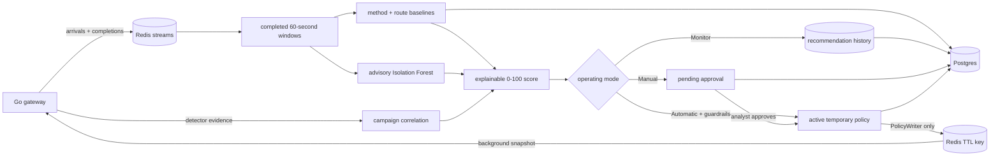

# Adaptive policy and analyst control

The adaptive system runs entirely in the Python control plane after a
60-second window closes. The Go gateway never calculates a baseline or loads a
model. It only reads an expiring policy snapshot in the background and makes a
bounded in-memory lookup before any request body is read.



## Baselines

Keys are the normalized HTTP method and configured route template, never the
raw URL or query string. `POST /api/login` and `GET /api/products` therefore
learn independently, while `/api/products/12` and `/api/products/34` share the
`GET /api/products/{id}` baseline.

For each endpoint the learner retains a bounded rolling sample and calculates
`median + mad_multiplier × max(MAD, minimum_mad)`. The result is clamped to the
configured endpoint limits. A threshold must clear hysteresis and cooldown
before changing. Until `warmup_windows` trusted samples exist,
`baseline_ready=false` and behavioural deviation cannot authorize a throttle
or block.

Only complete, detector-clean, allowed windows with all 60 consecutive gateway
health heartbeats enter learning. Windows with a signal, active enforcement,
missing completion, heartbeat gap, or telemetry-drop delta remain visible as
the latest observation but are excluded from the sample.

## Risk and confidence

The 0–100 risk score is a configured weighted sum of deterministic evidence,
endpoint deviation, campaign facts, and ML anomaly. Every stored recommendation
contains the raw component, configured weight, weighted points, final score,
and guardrail result.

Policy confidence is separate. It is derived only from deterministic gateway
evidence and campaign correlation. The Isolation Forest anomaly score is never
called confidence and cannot enforce by itself. An ML-only anomaly is saved as
monitor advice. ML-assisted blocking additionally requires a strong anomaly,
repeated deterministic evidence, and the configured confidence floor.

All defaults and bounds are in
`control-plane/configs/adaptive.json.example`. Set `IASG_ADAPTIVE_CONFIG` to
that path (or JSON text) for a non-Postgres launch. With Postgres enabled, the
dashboard stores the validated live configuration in `adaptive_settings` and
the control plane reads it at the start of every cycle.

The server and Python loader enforce the same safety envelope:

| Setting group | Validated bounds |
| --- | --- |
| Rolling/warm-up windows | 3-1440; warm-up cannot exceed the rolling sample |
| MAD multiplier / minimum MAD | 0.1-20 / 0-1000 |
| Learned endpoint RPM | ordered minimum and maximum within 1-100,000 |
| Hysteresis / baseline cooldown | 0-0.5 / 0-86,400 seconds |
| Risk weights | each 0-1 and total 1; action scores ordered within 0-100 |
| Confidence floors / ML strength | each 0-1; block confidence cannot be below throttle |
| Active durations | positive, each no greater than the 30-86,400 second global maximum |
| Throttle RPM | ordered minimum, default, maximum within 1-100,000 |
| Minimum evidence | throttle at least one request; block no lower than throttle |
| Emergency ranges | syntactically valid IPv4/IPv6 address or CIDR; allow wins on overlap |

Unknown fields are rejected instead of being silently ignored. Settings edits
use an optimistic version check, so one analyst cannot overwrite another
analyst's newer configuration from a stale page.

## Modes

| Mode | Result |
| --- | --- |
| Monitor | Score, learn, and store `recommended`; never auto-write a policy |
| Manual | Store `pending_approval`; an operator may edit inside guardrails, approve, or reject |
| Automatic | Write only non-monitor decisions that already pass all configured guardrails |

An emergency allow or temporary block is queued by the server, not written by
browser JavaScript. The control plane records it and sends it through
`policy/writer.py`. Manual overrides have explicit precedence over adaptive
endpoint and address policies. Every active policy has a Redis TTL; nothing
renews it. The durable lifecycle remains in Postgres after Redis expiry.

## Migration and model

New deployments auto-create the additive tables when the control plane starts.
Operators may apply the same idempotent migration explicitly:

```bash
psql "$IASG_POSTGRES_URL" -f control-plane/migrations/0002_adaptive_policy.up.sql
```

Capture and build labelled data by independent run, then train. Training uses
only benign rows assigned to the training partition; validation chooses the
threshold and test is reported separately.

```bash
cd control-plane
PYTHONPATH=. .venv/bin/python -m iasg.dataset.export \
  --runs ../datasets/raw/benign-1 ../datasets/raw/attacks-1 \
  --out ../datasets/v2
PYTHONPATH=. .venv/bin/python -m iasg.ml.train \
  --dataset ../datasets/v2 --out models/current
```

For Compose, train into the persistent model volume, then restart only the
off-path control plane so it loads the new artifact. The datasets mount is
read-only and no live retraining job exists:

```bash
docker compose -f infra/docker-compose.yml exec control_plane \
  python -m iasg.ml.train --dataset /datasets/v2 --out /app/models/current
docker compose -f infra/docker-compose.yml restart control_plane
```

The artifact metadata records model and schema versions, training time, run
IDs, scikit-learn version, missing-value rule, and validation/test results. No
automatic retraining exists. If the two deployed files are absent or invalid,
runtime records `model_available=false` and continues safely.

## Three-mode demo

Start from a fresh stack, open `http://localhost:5177/adaptive`, and keep the
control-plane log visible:

```bash
docker compose -f infra/docker-compose.yml up -d
docker compose -f infra/docker-compose.yml logs -f control_plane
```

1. Select **Monitor**, click **Save validated settings**, then seed a campaign:

   ```bash
   docker compose -f infra/docker-compose.yml exec control_plane \
     python -m tools.seed_evidence --scenario credential-stuffing
   ```

   After the next cycle, the recommendation appears in the audit/history but
   `docker compose -f infra/docker-compose.yml exec redis redis-cli --scan --pattern 'policy:*'`
   shows no adaptive key for the six `203.0.113.x` clients.

2. Select **Manual**, save, and use a different client:

   ```bash
   docker compose -f infra/docker-compose.yml exec control_plane \
     python -m tools.seed_evidence --scenario brute-force
   ```

   After one cycle, approve (or edit and approve) the pending
   `203.0.113.201` row. After the next cycle,
   `redis-cli GET policy:203.0.113.201` shows the active, expiring policy.

3. Select **Automatic**, save, then seed the independent flood scenario:

   ```bash
   docker compose -f infra/docker-compose.yml exec control_plane \
     python -m tools.seed_evidence --scenario flood
   docker compose -f infra/docker-compose.yml exec redis \
     redis-cli GET policy:198.51.100.7
   ```

   Wait one control-plane cycle plus the gateway's five-second snapshot
   refresh. The policy activates without approval. Exercise it from inside the
   Compose network, where the configured proxy trust makes the presented
   documentation address authoritative:

   ```bash
   docker compose -f infra/docker-compose.yml run --rm --no-deps ports_info \
     wget -S -q -O /dev/null --header='X-Forwarded-For: 198.51.100.7' \
     http://gateway:8082/api/products
   ```

4. In **Emergency override**, submit `198.51.100.7`, action **allow**, a
   bounded duration, and a reason. After the next cycle the address-wide manual
   allow outranks adaptive endpoint policy and gateway reflex; the audit
   timeline records the actor and reason. Its Redis TTL demonstrates automatic
   release.

The Admin reset clears history with `XTRIM` and preserves consumer groups. It
deliberately does not lift active enforcement; use the Policy page's explicit
delete action or wait for TTL expiry before repeating the same identities.
