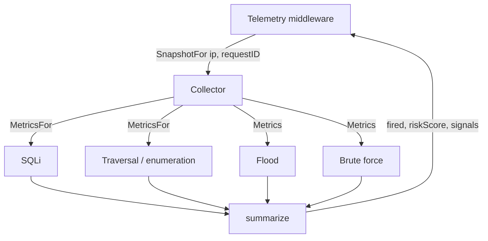

# Detection Signals

## Overview

Four detectors run on every allowed request. **Detectors never enforce.** They
observe, fill in a standard `Evidence` struct, and let the request continue.
Deciding what to do about what they saw is the control plane's job, and acting
on that decision is the enforcer's.

That separation is what makes the gateway safe to leave switched on: a
false positive costs a log line, not a refused customer.

## The four detectors

| Signal constant | Detector | Detects | Windowed? |
| --- | --- | --- | --- |
| `api_flooding` | `FloodDetector` | Request rate above the configured budget | Yes |
| `sql_injection` | `SQLiDetector` | SQL injection patterns in path, query, or body | No |
| `enumeration_path_traversal` | `TraversalEnumDetector` | `../` traversal and probes for `/.env`, `/.git`, `/wp-admin` | No |
| `brute_force` | `BruteForceDetector` | Repeated failed logins on configured login paths | Yes |

All four are configured under `enforcement:` in `configs/config.yaml`, and each
can be disabled individually.

## Evidence

Every detector answers `Metrics(ip)` with the same shape, so the collector and
the control plane can treat them uniformly:

| Field | Meaning |
| --- | --- |
| `signal` | Which detector this came from |
| `score` | 0–100 contribution for this signal |
| `thresholdCross` | True when the detector considers the signal fired |
| `attackType` | Detector-specific label; empty when clean |
| `details` | Free-form per-detector data, e.g. `requestRate` |

## Windowed versus request-scoped

The distinction matters more than it looks, because the enforcer sits *outside*
the detectors — a refused request never reaches them.

- **Windowed** detectors (flood, brute force) describe a rolling window. Their
  counts remain true whether or not the current request reached them, so they
  always report.
- **Request-scoped** detectors (SQLi, traversal) describe *one* request. If the
  request never reached them, they have nothing to say about it.

Request-scoped detectors implement `RequestScoped`:

```go
type RequestScoped interface {
    MetricsFor(ip, requestID string) Evidence
}
```

They store their result against the request ID that produced it, and telemetry
asks for evidence belonging to the request it is recording. Without this, a
blocked address could send one harmless request and have the gateway attach the
*previous* request's injection evidence to it — manufacturing fresh evidence
out of nothing, which the control plane would then ingest as a live attack.

`internal/signals/last_evidence.go` holds these results under a five-minute
TTL, keyed by IP and request ID; a mismatch returns empty evidence rather than
a stale hit.

## The collector

`signals.Collector` fans a lookup out across all four detectors and summarises
the result.



`SnapshotFor` routes each detector according to whether it implements
`RequestScoped`, then `summarize` reduces the set to the `fired`, `riskScore`,
and `signals` fields that end up in the telemetry event.

## Testing the detectors

`testing/signals/` holds shell scripts that drive a running gateway and assert
that it **detects without enforcing** — a 429 from these scripts is a failure.
See [Signal Test Scripts](modules/signal-tests.md).

```bash
GATEWAY_URL=http://localhost:8082 bash testing/signals/run_all.sh
```

Go unit tests cover the detectors directly:

```bash
cd gateway && go test ./internal/signals/... ./internal/telemetry/...
```

## Code references

| Path | Role |
| --- | --- |
| `internal/signals/evidence.go` | `Evidence`, `Detector`, `RequestScoped`, signal constants |
| `internal/signals/collector.go` | Fan-out, routing, and `summarize` |
| `internal/signals/last_evidence.go` | Request-scoped evidence store with TTL |
| `internal/signals/api_flooding.go` | Rate/flood detection |
| `internal/signals/sqli_injection.go` | SQL injection patterns |
| `internal/signals/enumeration_path_traversal.go` | Traversal and forced browsing |
| `internal/signals/brute_force.go` | Failed-login tracking |
| `internal/signals/body.go` | Body reading shared by the request-scoped detectors |
