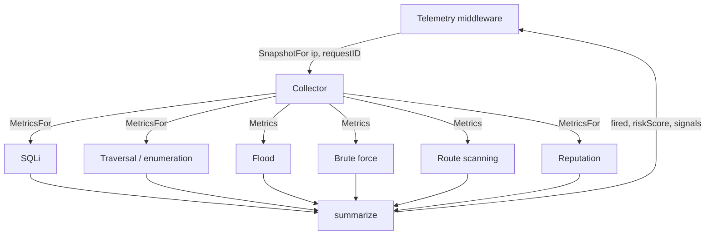

# Detection Signals

## Overview

Seven detectors run on every allowed request. **Detectors never enforce.** They
observe, fill in a standard `Evidence` struct, and let the request continue.
Deciding what to do about what they saw is the control plane's job, and acting
on that decision is the enforcer's.

That separation is what makes the gateway safe to leave switched on: a
false positive costs a log line, not a refused customer.

## The detectors

| Signal constant | Detector | Detects | Windowed? |
| --- | --- | --- | --- |
| `api_flooding` | `FloodDetector` | Request rate above the configured budget | Yes |
| `sql_injection` | `SQLiDetector` | SQL injection patterns in path, query, or body | No |
| `enumeration_path_traversal` | `TraversalEnumDetector` | `../` traversal and probes for `/.env`, `/.git`, `/wp-admin` | No |
| `consecutive_failed_logins` | `BruteForceDetector` | Consecutive configured invalid-credential outcomes, per client and login target | Yes |
| `unknown_route_scanning` | `UnknownRouteScanDetector` | Distinct raw paths classified as `<unmatched>` by the route table | Yes |
| `object_enumeration` | `ObjectEnumerationDetector` | One client requesting many distinct ids on an object endpoint (BOLA / IDOR) | Yes |
| `ip_reputation` | `ReputationDetector` | Addresses on a known-bad list | No — see below |

All are configured under `enforcement:` in `configs/config.yaml`, and each
can be disabled individually.

### Low-and-slow deterministic rules

`brute_force` deliberately has no list of paths or status-code guesses. The
structural `routes.auth_outcomes` declaration identifies each login route and
the backend statuses that mean `success` or `invalid_credentials`. Only a
configured invalid backend response grows a streak. A configured success resets
that route and target's streak; gateway refusals never reach the detector and
are never interpreted as authentication outcomes.

`unknown_route_scanning` consults the same compiled route table telemetry uses.
It records the raw path only after the table returns `<unmatched>`, so a known
route that happens to return a backend 404 is irrelevant. Repeating one broken
link remains one path; the detector needs several distinct paths in its rolling
window. `max_clients` and `max_paths_per_client` bound retained attacker input,
and inactive entries are swept after the configured window.

`object_enumeration` watches only the endpoints listed in
`routes.object_templates` -- ones that return a single object belonging to
someone, like `GET /api/orders/{id}`. Public lookups such as a product page are
left out on purpose: a shopper opening many products is not an attack. Per
client and per template it counts distinct identifiers in the window, and once
`distinct_ids` is reached the score rises by 20 when at least half the lookups
were refused (401/403/404) and by 10 when the ids include a run of five
consecutive numbers -- a script counting, rather than a person reopening their
own orders. It sits beside `brute_force`, next to the proxy, because it reads
the backend's status after the request.

Its limit is stated rather than hidden: the gateway cannot see who owns an
object. It detects the harvesting *pattern*; the fix for BOLA itself is an
ownership check in the application, which `GET /api/orders-secure/{id}` in the
demo backend shows.

All three are advisory-only: the gateway reflex rejects them even if they
are named in `block.signals`. They become an expiring throttle or block only
after control-plane correlation and the policy writer's safety checks.

### Reputation is the odd one out

The other four are *behavioural*: they count requests, failures or pattern
matches, and can say nothing until the attacker has repeated themselves. A
flood does not exist until a hundred requests have arrived.

Reputation asks a different question — not "what did this address just do" but
"who is this address". That is a standing fact, so it is the only detector that
knows something on a first request, and the only source of evidence about an
address that has done nothing yet.

It pays for that head start with a **cooldown**. A listed address is listed on
*every* request it makes, so firing each time would write one `Evidence` per
request: that swamps the control plane's dominant-detector count until a real
attack is described as "reputation", and multiplies volume on a stream that is
already drained slower than a flood fills it. Inside the cooldown the address
still scores — being listed is not an event that happens, it is a thing that is
true — it simply does not fire again. The same split SQLi makes for a
low-confidence match.

Knowing early is not the same as refusing early. The reflex observes *after*
the handler so enforcement adds no latency, which means a gateway-side block
always lands on the following request. The default configuration keeps
reputation as supporting context; if an operator explicitly adds it to
`block.signals`, a listed address is proxied once and refused from the second
request — against a hundred for a flood.

The list itself is a union: a file that ships with the repository, plus an
optional feed fetched on an interval and added to it. See
[Policy Enforcement](policy-enforcement.md) for how `block.signals` decides
whether it may act at all.

## Evidence

Every detector answers `Metrics(ip)` with the same shape, so the collector and
the control plane can treat them uniformly:

| Field | Meaning |
| --- | --- |
| `signal` | Which detector this came from |
| `score` | 0–100 contribution for this signal |
| `thresholdCross` | True when the detector considers the signal fired |
| `attackType` | Detector-specific label; empty when clean |
| `details` | Free-form per-detector data, e.g. `requestRate` |

## Windowed versus request-scoped

The distinction matters more than it looks, because the enforcer sits *outside*
the detectors — a refused request never reaches them.

- **Windowed** detectors (flood, failed-login, route scanning) describe a rolling window. Their
  counts remain true whether or not the current request reached them, so they
  always report.
- **Request-scoped** detectors (SQLi, traversal) describe *one* request. If the
  request never reached them, they have nothing to say about it.
- **Reputation** is request-scoped for a third reason. Its verdict is identical
  on every request, but only the request that *fired* should report a threshold
  cross — otherwise every request for a whole cooldown looks like a fresh hit.
  `Metrics(ip)` answers the address-wide question the reflex asks ("is this
  address known"); `MetricsFor` answers the per-request one telemetry asks.

Request-scoped detectors implement `RequestScoped`:

```go
type RequestScoped interface {
    MetricsFor(ip, requestID string) Evidence
}
```

They store their result against the request ID that produced it, and telemetry
asks for evidence belonging to the request it is recording. Without this, a
blocked address could send one harmless request and have the gateway attach the
*previous* request's injection evidence to it — manufacturing fresh evidence
out of nothing, which the control plane would then ingest as a live attack.

`internal/signals/last_evidence.go` holds these results under a five-minute
TTL, keyed by IP and request ID; a mismatch returns empty evidence rather than
a stale hit.

## The collector

`signals.Collector` fans a lookup out across all six detectors and summarises
the result.



`SnapshotFor` routes each detector according to whether it implements
`RequestScoped`, then `summarize` reduces the set to the `fired`, `riskScore`,
and `signals` fields that end up in the telemetry event.

## Testing the detectors

`testing/signals/` holds shell scripts that drive a running gateway and assert
that it **detects without enforcing** — a 429 from these scripts is a failure.
See [Signal Test Scripts](modules/signal-tests.md).

```bash
GATEWAY_URL=http://localhost:8082 bash testing/signals/run_all.sh
```

Go unit tests cover the detectors directly:

```bash
cd gateway && go test ./internal/signals/... ./internal/telemetry/...
```

## Code references

| Path | Role |
| --- | --- |
| `internal/signals/evidence.go` | `Evidence`, `Detector`, `RequestScoped`, signal constants |
| `internal/signals/collector.go` | Fan-out, routing, and `summarize` |
| `internal/signals/last_evidence.go` | Request-scoped evidence store with TTL |
| `internal/signals/api_flooding.go` | Rate/flood detection |
| `internal/signals/sqli_injection.go` | SQL injection patterns |
| `internal/signals/enumeration_path_traversal.go` | Traversal and forced browsing |
| `internal/signals/brute_force.go` | Failed-login tracking |
| `internal/signals/unknown_route_scanning.go` | Bounded distinct unmatched-path tracking |
| `internal/signals/object_enumeration.go` | Bounded distinct object-id tracking per template (BOLA) |
| `internal/signals/ip_reputation.go` | Known-bad address lookup and its cooldown |
| `internal/reputation/` | Loading the list, refreshing it, and the lookup itself |
| `internal/signals/body.go` | Body reading shared by the request-scoped detectors |
