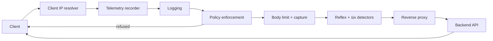
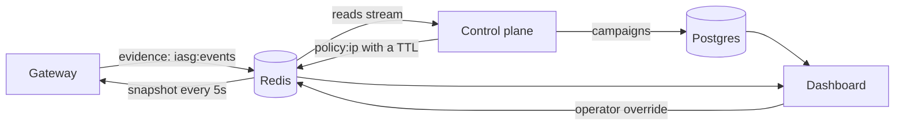

# Intelligent API Security Gateway

## Overview

The system sits in front of an HTTP API and decides, per request, whether that
request should be allowed, slowed down, or refused. It is built as **two
independent lanes**:

- **The data plane** — a Go reverse proxy that every request passes through. It
  runs on a microsecond budget, so it only ever does work that is cheap and
  bounded: match a pattern, increment a counter, read a map.
- **The control plane** — a Python agent that runs on a timer, off the request
  path. It reads what the gateway saw, groups related activity into campaigns,
  and decides what should be done about them.

The two lanes never call each other. They communicate only through Redis: the
gateway writes evidence, the control plane writes policy. Either one can be
stopped without taking the other down, which is the point — an agent that
crashes must not be able to take the API offline with it.

## Why the split

Anything that reasons about an attack needs history, and history takes time to
read. Doing that inside a request would put a network round trip — or an LLM
call — between a user and their response. Doing it on a timer instead means the
expensive thinking happens once every 30 seconds, and the request path only
pays for a map lookup.

The cost is delay: a decision reaches the gateway up to one refresh interval
after it is made. That is an acceptable trade for keeping the proxy fast and
keeping it independent.

## What each lane does

| Lane | Runs | Responsibility |
| --- | --- | --- |
| Gateway (`gateway/`) | Per request | Resolve the client IP, detect known attack shapes, enforce active policy, forward to the backend, record what happened |
| Control plane (`control-plane/`) | Every 30s | Read evidence, cluster it into campaigns, choose an action, write time-bounded policy |
| Dashboard (`gateway-dashboard/`) | On demand | Show live traffic, campaigns, and policy; let an operator override the agent |

## Five core mechanisms

The system has five decision-making mechanisms:

1. **Deterministic attack detectors** observe known attack shapes and emit
   evidence; they do not decide the response to the request they inspect.
2. **Adaptive endpoint baselines** learn normal traffic per normalized method
   and route from trusted completed windows.
3. **Campaign correlation** groups related evidence across addresses and cycles.
4. **The risk/confidence policy engine** turns evidence, behavioural deviation,
   and campaign facts into a bounded policy recommendation.

IP reputation is optional supporting evidence, never independent authority to
enforce. Body caps, detector cooldowns, Redis streams, token buckets, policy
snapshots, and TTLs are supporting enforcement/reliability mechanisms, not
additional detection algorithms. LLM narration runs after policy selection and
cannot influence risk, confidence, or enforcement; the offline template
provider is the safe default.

For the full decision explanation, see [Control Plane](control-plane.md) and
[Adaptive Policy and Analyst Control](adaptive-policy.md).

## Request path

Every request crosses seven middleware layers before reaching the backend, the
last of which fans out across the reflex observer and all six detectors. The
order is deliberate and is documented in [Request Lifecycle](request-lifecycle.md).

## The feedback loop

What makes this more than a pattern matcher is that the two lanes form a cycle.
The gateway's observations become the control plane's input, and the control
plane's decisions become the gateway's behaviour on the next refresh.

Enforcement releases itself. Every policy key carries a TTL, and nothing
renews one, so an action expires on its own unless the behaviour that caused
it happens again. See [Policy Enforcement](policy-enforcement.md).

## Where to go next

| Page | What it covers |
| --- | --- |
| [System Architecture](system-architecture.md) | The runtime structure of both lanes |
| [Request Lifecycle](request-lifecycle.md) | The middleware chain and why it is ordered as it is |
| [Detection Signals](detection-signals.md) | The six detectors and the evidence they produce |
| [Policy Enforcement](policy-enforcement.md) | How the gateway acts on the control plane's decisions |
| [Control Plane](control-plane.md) | The agent cycle, campaigns, and the escalation ladder |
| [Identifying the Client](client-ip.md) | Why the attributed IP is the foundation of everything else |
| [Running Locally](running-locally.md) / [Running with Docker](running-with-docker.md) | Getting it started |
| [Protecting Your Own API](protecting-your-own-api.md) | Putting the gateway in front of an API you run |
