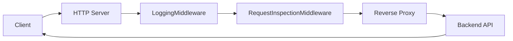

# Intelligent API Security Gateway

## Overview

The current implementation is a Go-based reverse proxy that listens for HTTP traffic, logs request metadata, inspects headers and body content, and forwards the request to a configured backend.

## Purpose

This documentation describes the parts of the repository that are implemented today so contributors can understand the active runtime path without mixing it with placeholder directories.

## Architecture Explanation

At runtime, `cmd/server/main.go` constructs a proxy server with a listen address, backend URL, and timeout values. `internal/proxy/server.go` builds a middleware chain containing request logging and request inspection, then hands the request to a reverse proxy created by `internal/proxy/reverse_proxy.go`. The reverse proxy forwards the request to the backend and adds the `X-Gateway: IASG` header.

## Code References

| Path | Relevance |
| --- | --- |
| `cmd/server/main.go` | Application entrypoint that constructs and starts the proxy server. |
| `internal/proxy/server.go` | Builds the HTTP server and middleware chain. |
| `internal/proxy/middleware.go` | Contains request logging and request inspection middleware. |
| `internal/proxy/reverse_proxy.go` | Creates the reverse proxy that forwards traffic to the backend. |

## Flow Diagram

