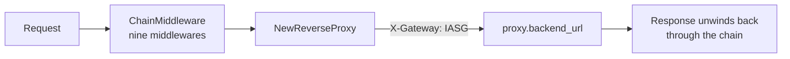

# Proxy Module

## Overview

`internal/proxy` owns listener startup, middleware assembly, and forwarding to
the protected backend. It is the package that decides what the request path
*is* — the detectors, telemetry, and enforcement all live elsewhere and are
composed here.

## Server construction

`proxy.NewServer` takes the loaded configuration. `Server.Start` then builds
the runtime in this order:

1. The four detectors, from `enforcement:` config
2. A `signals.Collector` over them
3. The Redis telemetry writer, if `storage.redis.enabled` — a failure here is
   logged and telemetry is disabled, not fatal
4. The client-IP resolver, from `server.trusted_proxies`
5. The policy enforcer, via `newEnforcer`
6. The chain, via `ChainMiddleware`, wrapped around the reverse proxy

`newEnforcer` is worth noting: when `enforcement.policy.enabled` is false it
returns a pass-through and **no Redis client is created at all**. That is what
keeps the gateway able to run with the control plane switched off.

## ChainMiddleware

```go
handler := ChainMiddleware(
    resolver.Middleware,
    telemetry.Middleware(eventWriter, s.collector),
    LoggingMiddleware,
    enforcer.Middleware,
    RequestInspectionMiddleware,
    floodDetector.Middleware,
    sqliDetector.Middleware,
    traversalEnumDetector.Middleware,
    bruteForceDetector.Middleware,
)(proxy)
```

**Index 0 is outermost.** The resolver is the first to see a request and the
last to see the response; the brute-force detector sits closest to the proxy.
The reasoning behind the ordering is in
[Request Lifecycle](../request-lifecycle.md), and the comment above this call in
`server.go` records it in the code as well.

## Middleware owned by this package

| Middleware | Behaviour |
| --- | --- |
| `LoggingMiddleware` | Prints method, path, resolved IP, and user agent to stdout |
| `RequestInspectionMiddleware` | Prints all headers, and reads the body then restores it with `io.NopCloser` so the proxy can still forward it |

!!! warning "Inspection prints request bodies"
    `RequestInspectionMiddleware` writes the raw body to stdout, which means
    credentials posted to a login endpoint appear in the gateway's logs in
    plaintext. It is useful while demonstrating the system and should not be
    left enabled anywhere real. Telemetry, by contrast, redacts what it stores
    — see `internal/telemetry/redact.go`.

## Forwarding

`NewReverseProxy` wraps `httputil.NewSingleHostReverseProxy` and sets
`X-Gateway: IASG` on the outbound request, so the backend can tell proxied
traffic from anything that reached it directly.

## A note on `security.go`

`SecurityMiddleware` in `internal/proxy/security.go` is a **compatibility
adapter only**. Attack detection moved to `internal/signals`; the function
constructs an SQLi detector and delegates. It is not part of the chain that
`Server.Start` assembles. New work belongs in `internal/signals` — see
[Detection Signals](../detection-signals.md).

## Flow



## Code references

| Path | Role |
| --- | --- |
| `internal/proxy/server.go` | Server construction, `newEnforcer`, chain assembly |
| `internal/proxy/middleware.go` | `ChainMiddleware`, logging, inspection |
| `internal/proxy/reverse_proxy.go` | Reverse proxy and header mutation |
| `internal/proxy/security.go` | Legacy adapter; superseded by `internal/signals` |
| `cmd/server/main.go` | Loads config and starts the server |
