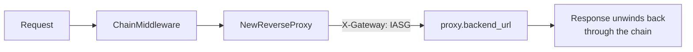

# Proxy Module

## Overview

`internal/proxy` owns listener startup, middleware assembly, and forwarding to
the protected backend. It is the package that decides what the request path
*is* — the detectors, telemetry, and enforcement all live elsewhere and are
composed here.

## Server construction

`proxy.NewServer` takes the loaded configuration. `Server.Start` then builds
the runtime in this order:

1. The five detectors, from `enforcement:` config
2. A `signals.Collector` over them
3. The bounded background Redis telemetry publisher, if `storage.redis.enabled`;
   Redis failure is non-fatal and publication reconnects after recovery
4. The client-IP resolver, from `server.trusted_proxies`
5. The gateway reflex and policy enforcer, via `newEnforcer`
6. The chain, via `ChainMiddleware`, wrapped around the reverse proxy

`enforcement.policy.enabled` controls whether control-plane policies are
consulted; the gateway reflex and opt-in baseline are independent. Policy
lookup uses a local snapshot. An applicable rate uses one bounded atomic Redis
quota check per request and fails open on Redis errors. See
[Policy enforcement](../policy-enforcement.md) for the action mapping and
adaptive rate configuration.

## ChainMiddleware

```go
handler := ChainMiddleware(
    resolver.Middleware,
    telemetry.Middleware(eventWriter, s.collector),
    LoggingMiddleware,
    enforcer.Middleware,
    BodyLimitMiddleware(maxBody),
    telemetry.CaptureBody,
    observedDetectors(reflex, s.collector,
        reputationDetector.Middleware,
        floodDetector.Middleware,
        sqliDetector.Middleware,
        traversalEnumDetector.Middleware,
        bruteForceDetector.Middleware,
    ),
)(proxy)
```

**Index 0 is outermost.** The resolver is the first to see a request and the
last to see the response; the brute-force detector sits closest to the proxy.
The reasoning behind the ordering is in
[Request Lifecycle](../request-lifecycle.md), and the comment above this call in
`server.go` records it in the code as well.

## Middleware owned by this package

| Middleware | Behaviour |
| --- | --- |
| `LoggingMiddleware` | Prints method, path, resolved IP, and user agent to stdout |
| `BodyLimitMiddleware` | Caps request bodies before downstream buffering; runs after policy enforcement so refused bodies are not read |
| `RequestInspectionMiddleware` | Legacy debug helper that prints headers and body; not installed in the live chain |

The active chain uses `telemetry.CaptureBody` after the body cap. It restores
the body for upstream forwarding and redacts the stored snippet through
`internal/telemetry/redact.go`. Policy refusals are recorded by the outer
telemetry middleware without buffering their bodies.

## Forwarding

`NewReverseProxy` wraps `httputil.NewSingleHostReverseProxy` and sets
`X-Gateway: IASG` on the outbound request, so the backend can tell proxied
traffic from anything that reached it directly.

## Where detection lives

Not here. `internal/proxy` builds and runs the chain; the detectors themselves
live in `internal/signals` and the blocking in `internal/enforcement`. An older
`security.go` in this package held a `SecurityMiddleware` compatibility adapter
that nothing called — it has been deleted. New detection work belongs in
`internal/signals` — see [Detection Signals](../detection-signals.md).

## Flow



## Code references

| Path | Role |
| --- | --- |
| `internal/proxy/server.go` | Server construction, `newEnforcer`, chain assembly |
| `internal/proxy/middleware.go` | `ChainMiddleware`, logging, inspection |
| `internal/proxy/reverse_proxy.go` | Reverse proxy and header mutation |
| `internal/proxy/security.go` | Legacy adapter; superseded by `internal/signals` |
| `cmd/server/main.go` | Loads config and starts the server |
