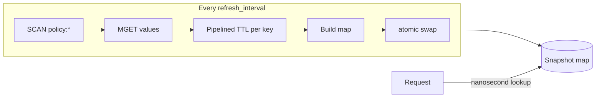

# Policy Enforcement

## Overview

Enforcement is where the control plane's decisions become the gateway's
behaviour. The control plane writes `policy:<ip>` keys into Redis; the gateway
reads them and refuses, slows, or allows traffic accordingly.

It is **off by default**. Turning it on is what lets an automated agent refuse
live traffic, so it should be a deliberate choice:

```yaml
enforcement:
  policy:
    enabled: true
    key_prefix: "policy:"
    refresh_interval: 5s
```

With `enabled: false` no Redis client is created at all and the middleware is a
pass-through — the gateway runs perfectly well with the control plane switched
off entirely.

## The decision contract

`policy.Decision` mirrors the JSON that `PolicyDecision.to_json` writes in
`control-plane/iasg/models.py`. Those two are the halves of the contract
between the lanes:

| Field | JSON key | Meaning |
| --- | --- | --- |
| `Action` | `action` | `monitor`, `throttle`, `temp_block`, or `escalate` |
| `CampaignID` | `campaign_id` | Which campaign produced this |
| `Confidence` | `confidence` | How sure the agent was |
| `Reason` | `reason` | Human-readable justification |
| `IssuedAt` | `issued_at` | When it was decided |
| `ExpiresIn` | `expires_in` | The agent's *intent* for the lifetime |

## What each action does

| Action | Gateway behaviour |
| --- | --- |
| `monitor` | Nothing. Never written as a key — it would be a no-op |
| `throttle` | Sleeps `enforcement.throttle.delay_ms`, then continues |
| `temp_block` | Responds `403` and stops |
| `escalate` | Responds `403` and stops |

An unrecognised action is allowed through. An action nobody understands must
never be able to block traffic.

The applied action is attached to the request context via
`policy.AttachOutcome`, so telemetry records `throttle` or `temp_block` in
`iasg:events` rather than always writing `allow`.

## Why the snapshot exists

The enforcer does not call Redis per request. A `GET` over TCP costs a few
hundred microseconds — orders of magnitude more than any detector — and it
would tie both the gateway's latency and its availability to Redis.

Instead `policy.Store` copies the whole policy set into a map on a ticker, and
requests read it through an `atomic.Pointer`:



`SCAN` rather than `KEYS`: `KEYS` walks the entire keyspace in one blocking
call, stalling Redis for every other client — including the control plane.

If a refresh fails, the last good snapshot is kept. Redis going down must never
take the gateway with it, and must never cause traffic to be refused that was
not being refused a second ago.

## Every action must be able to expire

The gateway relies on Redis dropping a key to restore service. Nothing renews a
policy key and nothing clears one, so a key with **no expiry has no release** —
one mistyped key would refuse an address permanently, with no record of why.

This is guarded on both sides:

- **Writing** (`control-plane/iasg/policy/writer.py`) refuses any decision
  whose `ttl_seconds` is missing or non-positive.
- **Enforcing** (`internal/policy/store.go`) reads each key's *real* TTL with a
  pipelined `TTL` call and skips any key Redis reports as unexpiring.

The second check is not redundant. `expires_in` inside the JSON is only the
agent's intent — a key can claim half an hour while carrying no expiry at all.
The gateway believes Redis, not the payload. An unreadable TTL is treated as no
TTL: the safe answer is to decline to enforce, never to enforce forever on the
strength of a failed lookup.

Refused keys are logged on change rather than every tick, because this is a
standing misconfiguration rather than a per-refresh event:

```
[policy] refusing 1 key(s) with no expiry: enforcement must be time-bounded
```

## Other rails on the writing side

`PolicyWriter.write` applies these in order:

1. Never touch loopback, private, or reserved addresses — with an exception for
   the RFC 5737 documentation ranges (`192.0.2.0/24`, `198.51.100.0/24`,
   `203.0.113.0/24`) so demos and tests still work.
2. Never write a bare `monitor`.
3. Never write a decision with no expiry.
4. Cap how many addresses one cycle may action (`max_ips_per_cycle`).
5. `dry_run` writes nothing at all.

## Inspecting live policy

```bash
redis-cli --scan --pattern 'policy:*'
redis-cli GET  policy:203.0.113.55
redis-cli TTL  policy:203.0.113.55     # -1 means no expiry: the gateway will refuse it
```

## Code references

| Path | Role |
| --- | --- |
| `internal/policy/store.go` | Snapshot refresh, TTL reading, unexpiring-key guard |
| `internal/policy/middleware.go` | The enforcing middleware and per-action behaviour |
| `internal/policy/outcome.go` | Carries the applied action to telemetry |
| `control-plane/iasg/policy/writer.py` | Writing rails |
| `control-plane/iasg/models.py` | `PolicyDecision.to_json`, the other half of the contract |
