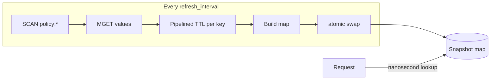

# Policy Enforcement

## Overview

Enforcement is where the control plane's decisions become the gateway's
behaviour. The control plane writes `policy:<ip>` keys into Redis; the gateway
reads them and refuses, slows, or allows traffic accordingly.

It is **off by default**. Turning it on is what lets an automated agent refuse
live traffic, so it should be a deliberate choice:

```yaml
enforcement:
  policy:
    enabled: true
    key_prefix: "policy:"
    refresh_interval: 5s
```

With `enabled: false` no Redis client is created at all and the middleware is a
pass-through — the gateway runs perfectly well with the control plane switched
off entirely.

## The decision contract

`policy.Decision` mirrors the JSON that `PolicyDecision.to_json` writes in
`control-plane/iasg/models.py`. Those two are the halves of the contract
between the lanes:

| Field | JSON key | Meaning |
| --- | --- | --- |
| `Action` | `action` | `monitor`, `throttle`, `temp_block`, or `escalate` |
| `CampaignID` | `campaign_id` | Which campaign produced this |
| `Confidence` | `confidence` | How sure the agent was |
| `Reason` | `reason` | Human-readable justification |
| `IssuedAt` | `issued_at` | When it was decided |
| `ExpiresIn` | `expires_in` | The agent's *intent* for the lifetime |
| `RequestsPerMinute` | `requests_per_minute` | What a throttled address may send. `0` means no rate named |

## What each action does

| Action | Gateway behaviour |
| --- | --- |
| `monitor` | Nothing. Never written as a key — it would be a no-op |
| `throttle` | Holds the address to `requests_per_minute`; `429` once it is over |
| `temp_block` | Responds `403` and stops |
| `escalate` | Responds `403` and stops |

An unrecognised action is allowed through. An action nobody understands must
never be able to block traffic.

The applied action is attached to the request context via
`policy.AttachOutcome`, so telemetry records `throttle`, `rate_limited` or
`temp_block` in `iasg:events` rather than always writing `allow`.

## What makes the rate limiting adaptive

Every address is held to a rate, and a policy replaces the one it would
otherwise get:

| Address | Allowed |
| --- | --- |
| No policy | The baseline, `enforcement.rate_limit.requests_per_minute` |
| In `block.exempt_cidrs` | Everything — never counted |
| Throttled, `low` / `medium` severity | 50 / min |
| Throttled, `high` severity | 20 / min |
| Blocked (`temp_block`, `escalate`) | Nothing — the request is refused outright |

The policy wins in **both** directions. A campaign judged worse than the
baseline is held tighter, and one judged better is allowed more: the control
plane looked at that address specifically, which is a better answer than the
figure everyone else gets.

`monitor` restrains nothing, so a monitored address falls back to the baseline
like anyone else rather than being waved through.

### The baseline is opt-in

`enforcement.rate_limit.enabled` counts requests and raises a flood signal.
`enforcement.rate_limit.enforce` — off by default — turns that same threshold
into a limit the gateway acts on.

Two flags rather than one, because noticing a flood and refusing traffic are
different decisions and only the second can turn a legitimate spike into an
outage. With `enforce` off the gateway behaves as it always did: it reports the
flood, and the only thing that refuses that traffic is the reflex or a policy.

One number, not two: the baseline *is* the detection threshold, so the alert and
the refusal can never disagree about what "too fast" means.

The rungs are a table rather than a formula, deliberately. The number an
operator is asked to justify should be one they can point at, not the output of
a weighting nobody can re-derive.

`policy.Limiter` counts each address over a sliding one-minute window and the
enforcer refuses anything past the allowance with **429**, not 403. The
distinction is real and worth keeping: a block says *not you*, a rate limit says
*not this fast*, and `Retry-After` tells a well-behaved client when it is worth
trying again. Refused requests still count, so hammering after a refusal does
not earn a way back in.

A blocked address never reaches the counter — it is refused before there is any
point counting it — and neither does an exempt one. The exempt list is
`block.exempt_cidrs`, reused rather than duplicated so there is a single answer
to "who does this gateway never refuse".

A rate of `0` means the policy named none, which is what a control plane older
than this field writes. The gateway falls back to the configured
`enforcement.throttle.delay_ms` then, so an old policy still enforces something
rather than silently becoming a pass-through.

### Recovery

Recovery is the policy expiring. When the key goes, the enforcer stops finding a
decision for that address and never consults the limiter for it again, so the
caller returns to the default limit immediately rather than waiting out the
counting window. The whole arc is therefore:

```
normal (100/min) → throttled (20/min, 429 over it) → policy TTL lapses → normal
```

No de-escalation ladder is involved. Each rung already carries its own TTL
(throttle 900s, block 1800s, escalate 3600s), and an address that goes quiet is
returned to normal in one step by expiry.

## Why the snapshot exists

The enforcer does not call Redis per request. A `GET` over TCP costs a few
hundred microseconds — orders of magnitude more than any detector — and it
would tie both the gateway's latency and its availability to Redis.

Instead `policy.Store` copies the whole policy set into a map on a ticker, and
requests read it through an `atomic.Pointer`:



`SCAN` rather than `KEYS`: `KEYS` walks the entire keyspace in one blocking
call, stalling Redis for every other client — including the control plane.

If a refresh fails, the last good snapshot is kept. Redis going down must never
take the gateway with it, and must never cause traffic to be refused that was
not being refused a second ago.

## Every action must be able to expire

The gateway relies on Redis dropping a key to restore service. Nothing renews a
policy key and nothing clears one, so a key with **no expiry has no release** —
one mistyped key would refuse an address permanently, with no record of why.

This is guarded on both sides:

- **Writing** (`control-plane/iasg/policy/writer.py`) refuses any decision
  whose `ttl_seconds` is missing or non-positive.
- **Enforcing** (`internal/policy/store.go`) reads each key's *real* TTL with a
  pipelined `TTL` call and skips any key Redis reports as unexpiring.

The second check is not redundant. `expires_in` inside the JSON is only the
agent's intent — a key can claim half an hour while carrying no expiry at all.
The gateway believes Redis, not the payload. An unreadable TTL is treated as no
TTL: the safe answer is to decline to enforce, never to enforce forever on the
strength of a failed lookup.

Refused keys are logged on change rather than every tick, because this is a
standing misconfiguration rather than a per-refresh event:

```
[policy] refusing 1 key(s) with no expiry: enforcement must be time-bounded
```

## Other rails on the writing side

`PolicyWriter.write` applies these in order:

1. Never touch loopback, private, or reserved addresses — with an exception for
   the RFC 5737 documentation ranges (`192.0.2.0/24`, `198.51.100.0/24`,
   `203.0.113.0/24`) so demos and tests still work.
2. Never write a bare `monitor`.
3. Never write a decision with no expiry.
4. Cap how many addresses one cycle may action (`max_ips_per_cycle`).
5. `dry_run` writes nothing at all.

## Inspecting live policy

```bash
redis-cli --scan --pattern 'policy:*'
redis-cli GET  policy:203.0.113.55
redis-cli TTL  policy:203.0.113.55     # -1 means no expiry: the gateway will refuse it
```

## Code references

| Path | Role |
| --- | --- |
| `internal/policy/store.go` | Snapshot refresh, TTL reading, unexpiring-key guard |
| `internal/policy/middleware.go` | The enforcing middleware and per-action behaviour |
| `internal/policy/outcome.go` | Carries the applied action to telemetry |
| `control-plane/iasg/policy/writer.py` | Writing rails |
| `control-plane/iasg/models.py` | `PolicyDecision.to_json`, the other half of the contract |
