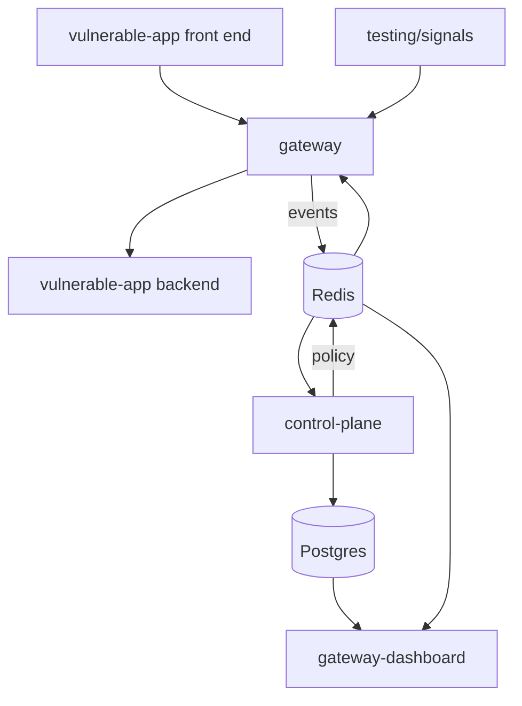

# Project Structure

## Overview

The repository holds four runnable components plus shared infrastructure. The
Go gateway is one of them, not the whole system.

## Top level

| Path | Role |
| --- | --- |
| `gateway/` | The Go data plane and this documentation |
| `control-plane/` | The Python agent. See [Control Plane](control-plane.md) |
| `gateway-dashboard/` | Next.js operations console |
| `vulnerable-app/` | Deliberately weak API and front end, used as the protected backend |
| `testing/signals/` | Shell scripts that drive a running gateway |
| `infra/` | Compose stack. See [Running with Docker](running-with-docker.md) |
| `mkdocs.yml` | Documentation config; `docs_dir` points at `gateway/docs` |

## Inside the gateway

| Path | Role |
| --- | --- |
| `cmd/server/` | Entrypoint; loads config, applies env overrides, starts the server |
| `internal/config/` | YAML schema, defaults, and validation |
| `internal/proxy/` | Server, middleware chain, reverse proxy |
| `internal/netutil/` | Client IP resolution and the trusted-proxy rules |
| `internal/signals/` | The five detectors, evidence, collector, evidence store |
| `internal/telemetry/` | Event shape, redaction, and the recording middleware |
| `internal/policy/` | Policy snapshot store, the enforcing middleware, the rate limiter |
| `internal/enforcement/` | The gateway's own reflex: block on a threshold cross |
| `internal/reputation/` | The known-bad list: load, refresh, look up |
| `internal/settings/` | Live reconfiguration over Redis, from the console |
| `internal/storage/redis/` | Redis telemetry writer |
| `configs/` | `config.yaml` and `config.yaml.example` |
| `docs/` | This documentation |

Enforcement is split on purpose. `internal/policy` acts on decisions the
control plane wrote and holds the per-address rate limiter;
`internal/enforcement` is the gateway's own reflex, for a threshold cross too
fast to wait a full agent cycle for.

There is no trust-scoring package. `internal/trust/` and the `trust_engine`
config block were both removed: the block was parsed into structs nothing read,
so it advertised a component that did not exist.

## Tests

Every package that makes a decision has tests beside it:

```
internal/config/config_test.go
internal/netutil/ip_test.go
internal/policy/middleware_test.go
internal/policy/store_test.go
internal/proxy/middleware_test.go
internal/signals/api_flooding_test.go
internal/signals/enumeration_path_traversal_test.go
internal/signals/sqli_injection_test.go
internal/signals/helpers_test.go
internal/telemetry/middleware_test.go
```

```bash
cd gateway && go test ./...
cd control-plane && python -m pytest
```

## Repository map

```text
.
├── gateway/
│   ├── cmd/server/main.go
│   ├── configs/
│   │   ├── config.yaml
│   │   └── config.yaml.example
│   ├── docs/                     # this site
│   │   ├── assets/
│   │   ├── stylesheets/extra.css
│   │   ├── modules/
│   │   └── requirements.txt
│   ├── internal/
│   │   ├── config/
│   │   ├── enforcement/
│   │   ├── netutil/
│   │   ├── policy/
│   │   ├── proxy/
│   │   ├── reputation/
│   │   ├── settings/
│   │   ├── signals/
│   │   ├── storage/redis/
│   │   └── telemetry/
│   └── go.mod
├── control-plane/
│   ├── iasg/
│   │   ├── assessment/  campaigns/  correlation/  evidence/
│   │   ├── explanation/ feedback/   policy/       reasoning/  store/
│   │   ├── config.py  models.py  runner.py  alerts.py
│   │   └── __main__.py
│   ├── tools/seed_evidence.py
│   └── tests/
├── gateway-dashboard/
│   ├── app/
│   │   ├── (console)/            # overview, campaigns, events, history, ip, policy, settings
│   │   ├── api/
│   │   ├── ui/
│   │   └── globals.css
│   └── lib/                      # redis, postgres, auth, geo, telemetry
├── vulnerable-app/
│   └── backend/
├── testing/signals/
│   ├── lib.sh  run_all.sh
│   ├── brute_force.sh  sqli.sh  flood.sh  traversal.sh
│   └── redis_inspect.sh
├── infra/
│   ├── docker-compose.yml
│   └── README.md
└── mkdocs.yml
```

## How the pieces connect


