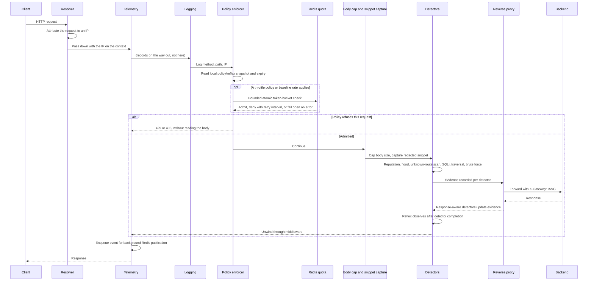

# Request Lifecycle

## Overview

A request crosses the middleware chain on the way in and unwinds back through it
on the way out. The order is not incidental — three of the positions were
chosen to fix specific bugs, and moving them would reintroduce those bugs.

## The path in

## Why the order is what it is

### The resolver must come first

Every detector keys its state by client IP, and the control plane writes policy
against that IP. If two components disagree about who the caller is, one of
them is counting the wrong machine.

The resolver settles the question once and puts the answer on the request
context, so everything downstream reads the same value.

### Telemetry sits just inside the resolver

Telemetry has to be outermost-but-one for two different reasons pulling in
opposite directions:

- **Outside the detectors and the enforcer**, so the enforcer's decision and
  any detector evidence are available when it records. A refused request is
  still enqueued for `iasg:events` with its policy outcome.
- **Inside the resolver**, so it reads the resolved IP.

That second point was a real defect. When telemetry wrapped the resolver
instead, it held the pre-resolution request, recorded the peer address, and
then looked up detector state under that wrong IP. Behind a proxy, every event
recorded `fired: []` and the control plane never saw an attack at all.

This outer telemetry stage does not read the body. After policy admission,
`BodyLimitMiddleware` caps it and `telemetry.CaptureBody` captures a redacted
snippet. A block or exhausted quota therefore returns before expensive body
buffering and inspection. The bounded publisher queue never waits for Redis
on the request path; it drops events when full and reconnects after outages.

### Detectors sit inside the enforcer

A request that the enforcer refuses never reaches a detector, which is correct:
the gateway should not spend pattern-matching work on traffic it has already
decided to drop.

The consequence is that a blocked request produces no new evidence of its own,
and telemetry must not attribute someone else's evidence to it. Request-scoped
detectors therefore record evidence against a request ID, and telemetry asks
for evidence belonging to *this* request. Windowed detectors — flood and brute
force — still report, because their state is genuinely about the window rather
than the individual request.

Without that, a blocked attacker could send harmless traffic and have the
gateway manufacture fresh-looking evidence for it.

## What gets recorded

`telemetry.Middleware` builds one JSON event per request and enqueues it for
background publication to the `iasg:events` Redis stream:

| Field | Meaning |
| --- | --- |
| `requestId` | Correlates the event with detector evidence |
| `ts` | When the request finished |
| `ip` | The resolved client IP |
| `method`, `path`, `query` | What was asked for |
| `status` | Final response status |
| `userAgent` | As sent |
| `decision` | Applied decision, including `allow`, `monitor`, `throttle`, `rate_limited`, `block`, `temp_block`, or `escalate` |
| `policy` | Optional structured match: action, source, client IP, route, method, RPM, reason, and outcome |
| `riskScore` | Summarised from the evidence |
| `fired` | Names of the detectors that fired |
| `signals` | The evidence itself |
| `snippet` | A redacted excerpt of what matched |
| `backendMs` | Time spent waiting on the backend |

`internal/telemetry/redact.go` scrubs the snippet before it is stored, so
credentials seen in a request body do not end up in the stream.

Policy lookup is local, with absolute expiry derived from Redis `PTTL`. Only
an applicable quota calls Redis synchronously: Lua shares token-bucket state
per client IP, exact URL path, and HTTP method across replicas, with a short
timeout and fail-open errors. Exhaustion returns `429` and `Retry-After`
without sleeping. Blocks return `403`. The gateway never calls Python,
PostgreSQL, or a model on this path. See
[Policy enforcement](policy-enforcement.md) for the schema, action mapping,
configuration, and verification commands.

## Code references

| Path | Role |
| --- | --- |
| `internal/proxy/server.go` | Assembles the chain; the comment above it records the ordering rationale |
| `internal/proxy/middleware.go` | `ChainMiddleware`, logging, inspection |
| `internal/netutil/ip.go` | Resolver and its middleware |
| `internal/telemetry/middleware.go` | Event construction and `SnapshotFor` |
| `internal/telemetry/redact.go` | Snippet redaction |
| `internal/signals/collector.go` | Routes request-scoped and windowed detectors |
| `internal/policy/middleware.go` | The enforcing middleware |
