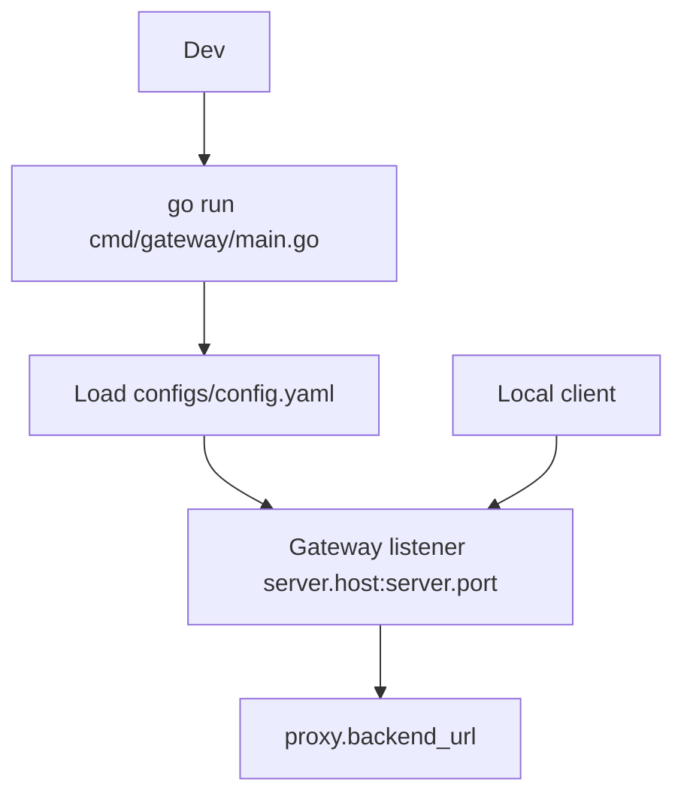

# Running the Gateway Locally

## Overview

The current local workflow is to run the gateway process directly with Go and point it at a reachable backend service.

## Purpose

This page provides the shortest path to exercise the implemented reverse proxy behavior.

## Architecture Explanation

The gateway now loads runtime configuration from YAML at startup.

- Default config path: `configs/config.yaml`
- Optional override: `IASG_CONFIG=/path/to/config.yaml`
- Fallback when default file is missing: `configs/config.yaml.example`
- Docker Compose reuses the same YAML file and overrides the backend with `IASG_BACKEND_URL`.

The listen address is built from `server.host` + `server.port`, and the upstream backend target comes from `proxy.backend_url`.

## Code References

| Path | Role |
| --- | --- |
| `cmd/gateway/main.go` | Current local execution path for the gateway process. |
| `internal/proxy/server.go` | Starts the HTTP server with timeouts and middleware. |
| `go.mod` | Declares the Go module and dependency graph. |

## Flow Diagram



## Steps

1. Ensure your backend URL is set in `configs/config.yaml` (or the example file).

   Example:

   ```yaml
   proxy:
       backend_url: "http://localhost:4000"
   ```

2. Start the backend service.

   ```bash
   python3 -m http.server 4000
   ```

3. Download Go dependencies and run the gateway:

   ```bash
   go mod download
   go run cmd/gateway/main.go
   ```

4. Send requests to your configured gateway address.

   With the example server settings (`host: 0.0.0.0`, `port: 8080`):

   ```bash
   curl -i http://localhost:8080
   ```

## Notes

- If `configs/config.yaml` does not exist, the gateway will attempt to load `configs/config.yaml.example`.
- PostgreSQL and Redis configuration are mapped in YAML and loaded by the gateway, even though not all modules are wired yet.
- In Docker Compose, the gateway uses the same config file and reads the backend target from `IASG_BACKEND_URL`.