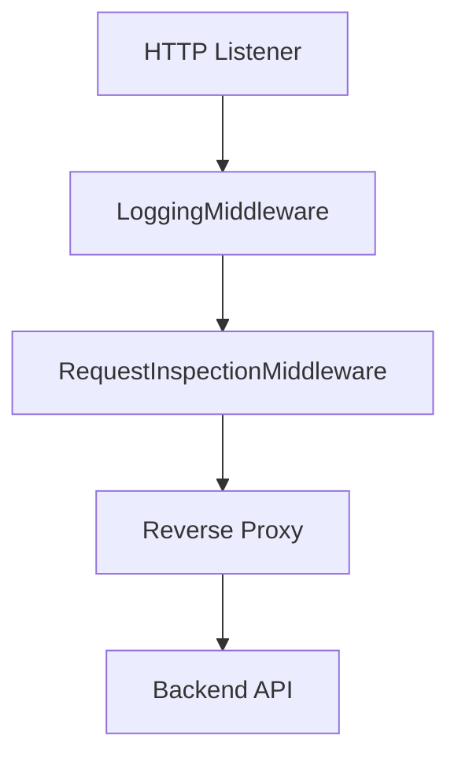

# System Architecture

## Overview

The implemented gateway is a small HTTP server wrapped around Go's standard reverse proxy.

## Purpose

This page describes the current runtime structure of the codebase without covering placeholder subsystems that are not wired into the binary.

## Architecture Explanation

The binary starts in `cmd/server/main.go`, where a `proxy.Server` is created with hardcoded values for the listen address, backend URL, and read and write timeouts. In `internal/proxy/server.go`, `Server.Start` creates a reverse proxy handler and wraps it with two middleware functions using `ChainMiddleware`. `LoggingMiddleware` prints request method, path, source IP, and user agent. `RequestInspectionMiddleware` prints all headers and, when a body is present, reads and logs the body before restoring it so the reverse proxy can still forward it. The final handler is a `httputil.NewSingleHostReverseProxy` instance that sends the request to the configured backend.

## Code References

| Path | Role |
| --- | --- |
| `cmd/server/main.go` | Starts the gateway and injects basic proxy configuration. |
| `internal/proxy/server.go` | Defines server startup and middleware assembly. |
| `internal/proxy/middleware.go` | Implements request logging and body inspection. |
| `internal/proxy/reverse_proxy.go` | Creates the reverse proxy and adds the `X-Gateway` header. |

## Flow Diagram

