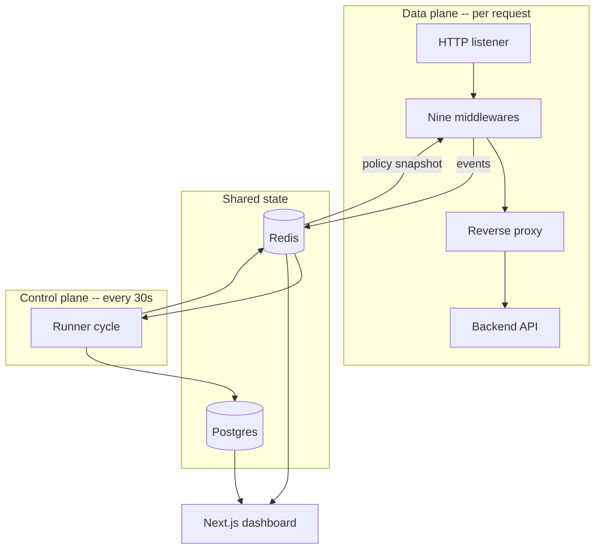

# System Architecture

## Overview

The gateway is a Go HTTP server wrapped around `httputil.ReverseProxy`, with a
chain of nine middlewares in front of it. Alongside it run a Python control
plane, a Next.js dashboard, Redis, and Postgres.

## Startup

`cmd/server/main.go` loads YAML configuration and starts a `proxy.Server`.
Three environment variables override the file, which is what lets the same
config work locally and under Compose:

| Variable | Overrides |
| --- | --- |
| `IASG_CONFIG` | Path to the config file (default `configs/config.yaml`) |
| `IASG_BACKEND_URL` | `proxy.backend_url` |
| `IASG_REDIS_HOST` | `storage.redis.host` |

`Server.Start` in `internal/proxy/server.go` then constructs, in order: the four
detectors, a `signals.Collector` over them, the Redis telemetry writer, the
client-IP resolver, and the policy enforcer. It assembles them with
`ChainMiddleware` and serves.

## The middleware chain

`ChainMiddleware` applies its arguments so that **index 0 is outermost** — the
first to see a request and the last to see the response.

| # | Middleware | Package | Role |
| --- | --- | --- | --- |
| 1 | `resolver.Middleware` | `netutil` | Decides which IP the request is attributed to |
| 2 | `telemetry.Middleware` | `telemetry` | Records the finished request to Redis |
| 3 | `LoggingMiddleware` | `proxy` | Prints request metadata to stdout |
| 4 | `enforcer.Middleware` | `policy` | Applies an active decision: throttle, block, escalate |
| 5 | `RequestInspectionMiddleware` | `proxy` | Prints headers and body |
| 6 | `floodDetector.Middleware` | `signals` | Request-rate flooding |
| 7 | `sqliDetector.Middleware` | `signals` | SQL injection patterns |
| 8 | `traversalEnumDetector.Middleware` | `signals` | Path traversal and forced browsing |
| 9 | `bruteForceDetector.Middleware` | `signals` | Repeated failed logins |

Then `NewReverseProxy` sets `X-Gateway: IASG` and forwards upstream.

Two orderings in that list carry real weight, and both are explained in
[Request Lifecycle](request-lifecycle.md): the resolver must precede telemetry,
and the detectors sit *inside* enforcement, so a refused request never reaches
them.

## Runtime structure

## Why the gateway never blocks on Redis

The enforcer does not read Redis per request. `policy.Store` copies every
`policy:<ip>` key into a map on a background ticker, and requests read that map
through an `atomic.Pointer`, so a lookup is a few nanoseconds and never touches
the network.

That choice buys three things: request latency stays independent of Redis
latency, the gateway keeps working when Redis is unreachable, and a Redis
outage can never cause traffic to start being refused. It costs staleness of up
to `enforcement.policy.refresh_interval` (5s by default) — far shorter than the
30s cadence at which new decisions are produced.

## Components outside the gateway

| Component | Location | Notes |
| --- | --- | --- |
| Control plane | `control-plane/` | Python agent, `python -m iasg`. See [Control Plane](control-plane.md) |
| Dashboard | `gateway-dashboard/` | Next.js 15, port 5177. See [Command Center Dashboard](modules/dashboard.md) |
| Vulnerable app | `vulnerable-app/` | Deliberately weak API used as the protected backend |
| Compose stack | `infra/docker-compose.yml` | See [Running with Docker](running-with-docker.md) |

## Code references

| Path | Role |
| --- | --- |
| `cmd/server/main.go` | Entrypoint; loads config and applies env overrides |
| `internal/config/config.go` | YAML schema and defaults |
| `internal/proxy/server.go` | Builds the detectors, resolver, enforcer, and the chain |
| `internal/proxy/middleware.go` | `ChainMiddleware`, logging, request inspection |
| `internal/proxy/reverse_proxy.go` | Reverse proxy and the `X-Gateway` header |
| `internal/netutil/ip.go` | Client IP resolution |
| `internal/telemetry/` | Event shape, redaction, recording middleware |
| `internal/policy/` | Policy snapshot store and the enforcing middleware |
| `internal/signals/` | The four detectors, evidence, and the collector |
